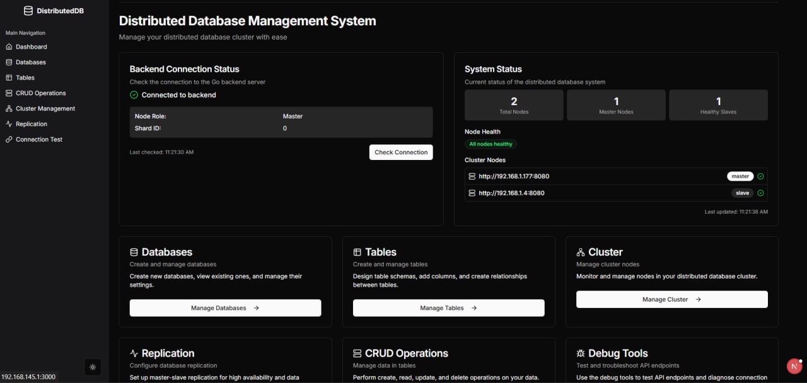

# Distributed Database Management System

This project is a **Golang-based distributed database system** with a professional **Next.js + Tailwind CSS frontend interface**. It features sharding, replication, automatic failover, and full CRUD and schema management via a clean UI and RESTful APIs.

---

## Project Structure

```
.
├── backend/    # Golang backend for database management
└── frontend/   # Next.js + Tailwind CSS UI for management and monitoring
```

---

## Features

### Backend

* Master/Slave node architecture
* Automatic master election and failover
* Horizontal sharding support
* Binary log + HTTP fallback replication
* Foreign key linkage between tables
* RESTful APIs for DB/Table/Record operations
* Node registration, health check, graceful shutdown

### Frontend

* Dashboard: node + replication status
* DB/Table creation and listing
* CRUD record operations
* Foreign key table linking
* Dark/light mode toggle
* Responsive design for all devices

---

## Technologies Used

### Backend

* **Go (Golang)**
* **MySQL 8+**
* Libraries:

  * [`gorilla/mux`](https://github.com/gorilla/mux)
  * [`go-sql-driver/mysql`](https://github.com/go-sql-driver/mysql)

### Frontend

* **Next.js** (React framework)
* **Tailwind CSS** (utility-first styling)
* **Shadcn UI**
* **Lucide React** (icons)
* **React Hook Form**
* **next-themes**

---

## Getting Started

### Backend Setup

1. Navigate to backend:

   ```bash
   cd backend
   ```
2. Install Go modules:

   ```bash
   go mod tidy
   ```
3. Start the node:

   ```bash
   go run main.go
   ```

### Frontend Setup

1. Navigate to frontend:

   ```bash
   cd frontend
   ```
2. Install dependencies:

   ```bash
   npm install
   ```
3. Start the development server:

   ```bash
   npm run dev
   ```

---

## Configuration

### Backend

Create a `config.json` file:

```json
{
  "self_url": "http://localhost:8080",
  "master_url": "http://localhost:8080",
  "shard_count": 3,
  "mysql": {
    "user": "root",
    "password": "yourpassword",
    "host": "127.0.0.1",
    "port": "3306"
  },
  "replication": {
    "user": "replica",
    "password": "replica_password"
  }
}
```

---

## Backend API Overview

| Method | Endpoint                 | Purpose                              |
| ------ | ------------------------ | ------------------------------------ |
| GET    | `/api/nodes`             | List all nodes in cluster            |
| POST   | `/api/register`          | Register this node                   |
| GET    | `/api/health`            | Health check                         |
| GET    | `/api/node-role`         | Get current node's role and shard ID |
| POST   | `/api/create-db`         | Create new database                  |
| POST   | `/api/drop-db`           | Drop a database                      |
| GET    | `/api/list-databases`    | List databases                       |
| POST   | `/api/create-table`      | Create a new table                   |
| POST   | `/api/drop-table`        | Drop a table                         |
| GET    | `/api/list-tables`       | Get table list with columns          |
| POST   | `/api/link-tables`       | Add foreign key constraints          |
| POST   | `/api/crud`              | Perform CRUD operations              |
| POST   | `/api/shutdown`          | Shutdown node                        |
| POST   | `/api/setup-replication` | Configure slave replication          |

---

 ## Backend Preview

You can explore and test all backend API endpoints via Postman: [Postman Documentation](https://documenter.getpostman.com/view/37511979/2sB2qUp5sD)

---

## Frontend Preview

---

## License

This project is a **project** for the **Distributed Database** course. It was developed under the supervision of **Dr. Ibrahim El-Awady** and **TA Fares Ahmed Diab**.&#x20;

---

---

## Architecture


---

## Authors

Crafted with care by:

* **Khaled Ibrahem**
* **Mohamed Abdelmawla**

Contributions, feedback, and pull requests are welcome!
