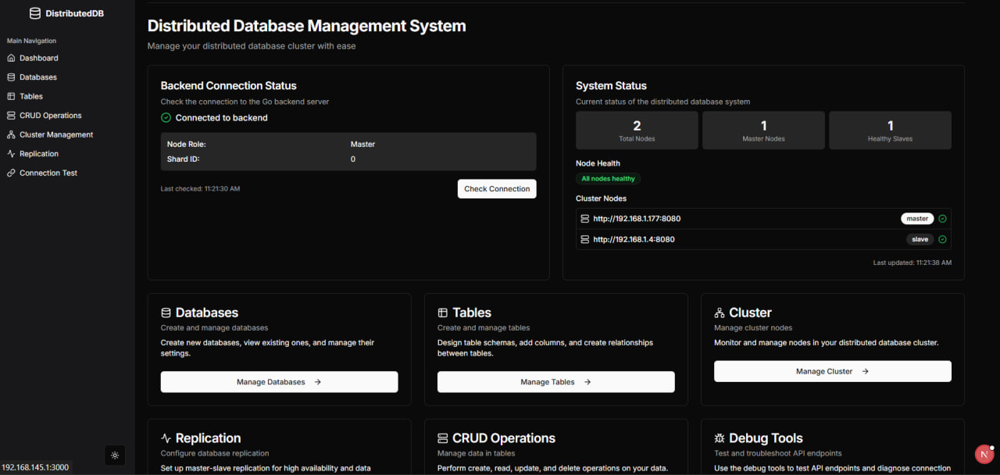

# Distributed Database Management System Frontend

A professional frontend interface for managing a distributed database system built with Next.js and Tailwind CSS.



## Features

- **Dashboard**: Overview of system status and quick access to main features
- **Database Management**: Create, view, and delete databases
- **Table Management**: Design table schemas, add columns, and create relationships
- **CRUD Operations**: Perform create, read, update, and delete operations on your data
- **Cluster Management**: Monitor and manage nodes in your distributed database cluster
- **Replication**: Configure master-slave replication for high availability
- **Debug Tools**: Test API endpoints and troubleshoot connection issues
- **Dark Mode**: Toggle between light and dark themes for comfortable viewing
- **Responsive Design**: Works on desktop, tablet, and mobile devices

## Technologies Used

- **Next.js**: React framework for building the user interface
- **Tailwind CSS**: Utility-first CSS framework for styling
- **Shadcn UI**: Component library for consistent design
- **Lucide React**: Icon library
- **React Hook Form**: Form validation and handling
- **next-themes**: Theme management for dark/light mode

## Prerequisites

- Node.js 18.x or higher
- Go 1.19 or higher (for backend)
- MySQL 8.0 or higher

## Installation

### Frontend Setup

1. Clone the repository:
   ```bash
   git clone https://github.com/yourusername/distributed-db-frontend.git
   cd distributed-db-frontend
